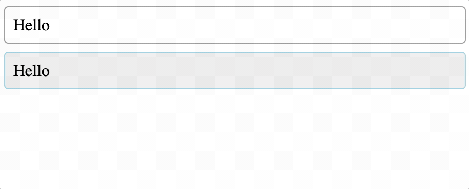
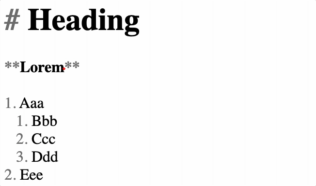
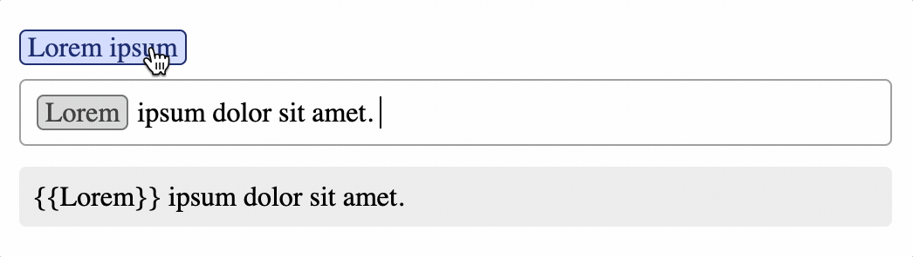

# react-fluent-edit

[![CI status][github-ci-action-image]][github-ci-action-url]
[![CodeQL status][github-codeql-analysis-action-image]][github-codeql-analysis-action-url]

[github-ci-action-image]: https://github.com/sodenn/react-fluent-edit/actions/workflows/ci.yml/badge.svg
[github-ci-action-url]: https://github.com/sodenn/react-fluent-edit/actions/workflows/ci.yml
[github-codeql-analysis-action-image]: https://github.com/sodenn/react-fluent-edit/actions/workflows/codeql-analysis.yml/badge.svg
[github-codeql-analysis-action-url]: https://github.com/sodenn/react-fluent-edit/actions/workflows/codeql-analysis.yml

Brings easy-to-use mentions, markdown and DnD (WIP) features to [Slate](https://github.com/ianstormtaylor/slate).

Examples and code snippets: [https://react-fluent-edit.vercel.app](https://react-fluent-edit.vercel.app/?path=/docs/fluentedit--basic)

## Installation

Install the core package in your project directory:

```bash
// with npm
npm install @react-fluent-edit/core

// with yarn
yarn add @react-fluent-edit/core
```

Since **react-fluent-edit** is based on **Slate**, the following dependencies also need to be installed:

```bash
// with npm
npm install slate slate-history slate-react

// with yarn
yarn add slate slate-history slate-react
```

### Packages

Install additional packages of your choice:

- **@react-fluent-edit/mentions**<br>
  
- **@react-fluent-edit/markdown**<br>
  Markdown autocompletion and highlighting.<br>
  
- **@react-fluent-edit/dnd**<br>
  Allows dragging HTML elements into the editor.<br>
  
- **@react-fluent-edit/mui**<br>
  Bindings for using [MUI (Material UI)](https://mui.com/) with react-fluent-edit.<br>
  
