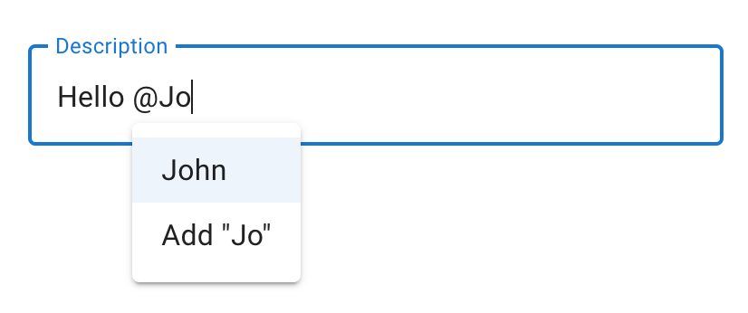

# react-fluent-edit

[![CI status][github-ci-action-image]][github-ci-action-url]
[![CodeQL status][github-codeql-analysis-action-image]][github-codeql-analysis-action-url]

[github-ci-action-image]: https://github.com/sodenn/react-fluent-edit/actions/workflows/ci.yml/badge.svg
[github-ci-action-url]: https://github.com/sodenn/react-fluent-edit/actions/workflows/ci.yml
[github-codeql-analysis-action-image]: https://github.com/sodenn/react-fluent-edit/actions/workflows/codeql-analysis.yml/badge.svg
[github-codeql-analysis-action-url]: https://github.com/sodenn/react-fluent-edit/actions/workflows/codeql-analysis.yml

Brings easy-to-use mentions and rich text (WIP) features to [Slate](https://github.com/ianstormtaylor/slate).

<p align="center">
  
  
</p>

## Installation

Install the core package in your project directory with:

```bash
// with npm
npm install @react-fluent-edit/core

// with yarn
yarn add @react-fluent-edit/core
```

Install additional packages of your choice:

```bash
// with npm
npm install @react-fluent-edit/mentions @react-fluent-edit/mui

// with yarn
yarn add @react-fluent-edit/mentions @react-fluent-edit/mui
```
